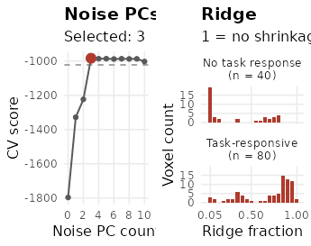
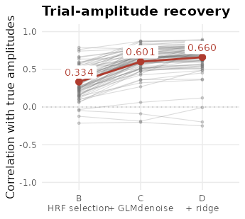
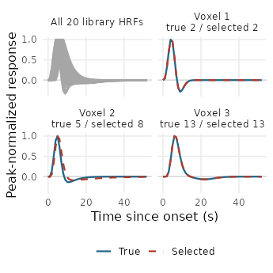

# GLMsingle in fmrilss: library HRFs, GLMdenoise and fractional ridge

## What GLMsingle estimates

GLMsingle (Prince et al., 2022) estimates one response amplitude per
trial and voxel. Use
[`glmsingle()`](https://bbuchsbaum.github.io/fmrilss/reference/glmsingle.md)
when you want to select an HRF from a library, estimate shared noise
regressors, and choose ridge shrinkage from repeated conditions across
runs. The procedure builds on a single-trial general linear model (GLM):

1.  **Select an HRF per voxel (type B).** Choose the best-fitting shape
    from a library of 20 haemodynamic response functions (HRFs).
2.  **Add GLMdenoise regressors (type C).** Identify a pool of voxels
    with weak task fit, remove polynomial trends from their time series,
    and use principal components (PCs) of the normalized residuals as
    nuisance regressors. Cross-validation selects the number of PCs.
3.  **Apply fractional ridge regression (type D).** Cross-validation
    selects shrinkage separately for each voxel. By default, the ridge
    estimates are then rescaled and offset to best match the
    unregularised estimates.

An initial ON-OFF model (type A) uses one regressor for all trials and
helps define the noise pool. Both default cross-validations compare
trial betas for **the same condition in different runs**. Without those
repeats, their data-driven choices are unavailable; the function warns
and disables the stages that require them.

The implementation solves each run separately and reuses matrix products
to score candidate models. The final sections describe the differences
from the reference implementation and how numerical agreement is tested.

## A simulated experiment

The simulation has four runs of 110 time points, sampled every second.
Each run contains trials from eight conditions, with every condition
repeated across runs. Voxels differ in HRF shape and share slow
structured noise. Eighty voxels respond to the task; the remaining forty
provide a potential noise pool for GLMdenoise.

``` r

library(fmrilss)
set.seed(2024)
tr <- 1; stimdur <- 3
n_runs <- 4; n_time <- 110; n_vox <- 120; n_cond <- 8
lib <- glmsingle_hrf_library(stimdur, tr)
true_hrf <- sample(ncol(lib), n_vox, replace = TRUE)
responsive <- seq_len(n_vox) <= 80
cond_mean <- matrix(rnorm(n_cond * n_vox, 1.5, 1), n_cond)
load <- matrix(rnorm(3 * n_vox, 0, 1.5), 3)

design <- Y <- true_beta <- vector("list", n_runs)
for (r in seq_len(n_runs)) {
  onsets <- seq(3, n_time - 15, by = 4) + sample(0:1, 1)
  cond <- sample(rep_len(seq_len(n_cond), length(onsets)))
  D <- matrix(0, n_time, n_cond)
  D[cbind(onsets + 1, cond)] <- 1
  amp <- cond_mean[cond, ] + matrix(rnorm(length(onsets) * n_vox, 0, 0.5), length(onsets))
  amp[, !responsive] <- 0
  signal <- vapply(seq_len(n_vox), function(v) {
    s <- numeric(n_time); s[onsets + 1] <- amp[, v]
    stats::convolve(s, rev(lib[, true_hrf[v]]), type = "open")[seq_len(n_time)]
  }, numeric(n_time))
  latent <- apply(matrix(rnorm(3 * n_time), n_time), 2, cumsum) * 0.4
  noise <- matrix(rnorm(n_time * n_vox), n_time) + latent %*% load
  Y[[r]] <- 1000 * (1 + 0.01 * (signal + noise))
  design[[r]] <- D
  true_beta[[r]] <- amp
}
true_beta <- do.call(rbind, true_beta)  # trials x voxels, chronological
```

`design` contains one time-by-condition 0/1 matrix per run, with a 1 at
each trial onset. Unlike the trial matrices passed to
[`lss()`](https://bbuchsbaum.github.io/fmrilss/reference/lss.md), these
are onset indicators, not HRF-convolved regressors.

You can also supply a data frame with `run`, `onset` (seconds, on the TR
grid), and `condition` columns, or use
[`glmsingle_design()`](https://bbuchsbaum.github.io/fmrilss/reference/glmsingle_design.md)
with an fmridesign event model. For list-valued `Y`, ascending event run
IDs correspond to the list order. For a single data matrix, supply
scan-level `runs`; event IDs are matched to the runs in data order.

## Fitting

``` r

fit <- glmsingle(Y, design, tr = tr, stimdur = stimdur, verbose = FALSE)
fit
#> <glmsingle_fit>
#>   4 runs, 96 trials, 8 conditions, 120 voxels
#>   models: A (ON-OFF), B (HRF library), C (GLMdenoise), D (fractional ridge) 
#>   noise PCs selected: 3
#>   median ridge fraction: 0.70
#>   elapsed: 0.5 s
```

The result contains `typea`, `typeb`, `typec`, and `typed` lists using
GLMsingle’s field names. Types B–D contain trial-by-voxel betas, ordered
by run and then by onset within each run. Betas are in percent signal
change by default. `coef(fit)` extracts type D; pass `"b"` or `"c"` to
extract an earlier stage.

``` r

dim(coef(fit))            # type D
#> [1]  96 120
fit$typed$pcnum           # number of GLMdenoise components
#> [1] 3
```

A ridge fraction of 1 means no shrinkage; smaller fractions request more
shrinkage before the final rescaling. `pcnum` is the selected number of
noise components, shared across voxels; `FRACvalue` contains one
fraction per voxel.

### What did cross-validation choose?

The left panel shows `xvaltrend`: the negative median cross-validation
loss over the voxels used to choose the PC count. Higher is better; it
measures agreement between betas for repeated conditions across runs,
not time-series R^2. With the default `pcstop = 1.05`, the algorithm
takes the first PC count whose improvement over zero PCs is at least
`1 / 1.05` (about 95%) of the best improvement. The dashed line marks
that threshold, and the red point marks the selected count.

The right panels show the selected ridge fractions separately for the
two **simulated** voxel groups. These labels come from the generating
model, not from GLMsingle’s estimated noise pool. Counts have a common
scale; the groups contain 80 and 40 voxels, respectively.

``` r

pc_scores <- data.frame(
  PCs = seq_along(fit$typec$xvaltrend) - 1L,
  score = fit$typec$xvaltrend
)
pc_threshold <- pc_scores$score[1] +
  (max(pc_scores$score) - pc_scores$score[1]) / fit$settings$pcstop
ridge_choices <- data.frame(
  fraction = fit$typed$FRACvalue,
  group = ifelse(responsive, "Task-responsive\n(n = 80)", "No task response\n(n = 40)")
)
```



Cross-validation diagnostics from the same fit. Ridge fractions describe
shrinkage before the default final rescaling and offset; they are not
the final ratio of estimated to true amplitude.

## Did the data-driven steps help?

Because the generating amplitudes are known, we can compare estimated
and true betas in the responsive voxels. For each voxel, we correlate
estimated and true amplitudes across all trials. This measures agreement
in trial-to-trial variation, but does not measure amplitude bias or
absolute estimation error. Correlation is undefined for the forty
nonresponsive voxels, whose true amplitudes are all zero, so they are
excluded here.

``` r

voxel_cor <- sapply(c("b", "c", "d"), function(stage) {
  B <- coef(fit, stage)
  vapply(which(responsive), function(v) {
    stats::cor(B[, v], true_beta[, v])
  }, numeric(1))
})
round(colMeans(voxel_cor), 3)
#>     b     c     d 
#> 0.334 0.601 0.660
```



Each thin line follows one of the 80 responsive voxels; red points and
labels show the mean at each stage. The spread and downward segments
remain visible alongside the average improvement.

In this simulation, mean recovery improves from B to C and again from C
to D. The voxel-level lines show why the mean alone is incomplete: 3
voxels have lower correlations after denoising, and 2 after ridge. A
useful step on average need not help every voxel. This is one fixed
simulated experiment, not a guarantee of improvement for another
acquisition.

### Which HRF shapes were recovered?

The library contains responses to a 3-second stimulus, sampled every 1
second and normalized to a peak of one. Its 20 shapes differ in their
timing, width, and undershoot. The first panel shows the full library;
the remaining panels compare the generating and selected shapes for
voxels 1, 2, and 3, chosen by index before inspecting recovery.

``` r

example_voxels <- 1:3
data.frame(voxel = example_voxels,
           true_index = true_hrf[example_voxels],
           selected_index = fit$typeb$HRFindex[example_voxels])
#>   voxel true_index selected_index
#> 1     1          2              2
#> 2     2          5              8
#> 3     3         13             13
```



All curves use the same time and peak-normalized amplitude scales. Solid
blue curves are the generating HRFs; dashed red curves are the selected
library shapes. Coincident curves indicate an exact library match.

Nearby library indices do not necessarily imply equally small waveform
differences, so the curves are more informative than index distance
alone. These examples illustrate the selection step; the recovery plot
above uses all responsive voxels.

## Choices that differ from the reference implementation

Two defaults differ from the pinned Python reference (commit `1ab54a6`):

| Argument | fmrilss default | Option that follows the Python reference |
|----|----|----|
| `extras_in_denoise` | `"always"`: retain user nuisance regressors, such as motion, in every GLMdenoise and ridge fit | `"with_pcs"`: omit them when zero PCs are used, including from the cross-validation reference |
| `zero_sd_cv` | `"zero"`: give zero cross-validation weight to voxels whose reference betas have zero variance | `"python"`: reproduce the reference helper’s candidate-dependent treatment of zero variance |

Two further options control singular designs and the ridge calculation.
`singular = "error"` follows GLMsingle’s default; `"pinv"` instead
returns a minimum-norm solution with a warning.
`frac_alpha = "fracridge"` uses the reference grid interpolation to
obtain ridge penalties; `"exact"` solves the fraction equation directly
and is experimental.

The automatic ON-OFF R^2 threshold uses a deterministic Gaussian-mixture
fit with a small variance floor, following the MATLAB approach; the
Python mixture fit is unseeded. Pass `brain_r2` and `pc_r2_cutoff` to
set the thresholds explicitly. Empty or rank-zero noise pools use zero
PCs; otherwise the maximum PC count is capped at the available rank
across runs.

fmrilss computes in double precision, uses 1-based HRF indices, and
applies `want_percent_bold` to all model types. The Python reference
uses single precision and always scales types C and D to percent signal
change.

`full_glmbadness = TRUE` fills the PC cross-validation diagnostic for
every voxel. By default only the voxels that decide the number of PCs
are evaluated, which gives identical estimates.

## How agreement with GLMsingle is checked

The package tests compare
[`glmsingle()`](https://bbuchsbaum.github.io/fmrilss/reference/glmsingle.md)
with pinned Python GLMsingle on 11 simulated scenarios: default
settings, extra regressors, two sessions with grouped folds, unequal run
lengths, unrepeated conditions, rapid events, near-collinear regressors,
an all-zero voxel, a single ridge fraction, and no HRF library. The
tests require matching HRF choices and PC counts. Beta and
ridge-fraction comparisons exclude cases classified as numerically
unstable in the Python reference. Beta tolerances depend on the design’s
condition number, accounting for the loss of precision in float32 normal
equations; they do not impose a uniform 1e-6 bound.

Separate tests compare the computational stages in double precision with
dense implementations of GLMsingle’s stacked calculations. Together,
these checks test implementation agreement in the specified scenarios;
they do not establish which estimator is best for a new acquisition.

## Reference

Prince, J. S., Charest, I., Kurzawski, J. W., Pyles, J. A., Tarr, M. J.,
& Kay, K. N. (2022). Improving the accuracy of single-trial fMRI
response estimates using GLMsingle. *eLife*, 11, e77599.
