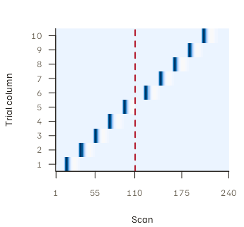

# Run-aware LSS with fmridesign

[`lss_design()`](https://bbuchsbaum.github.io/fmrilss/reference/lss_design.md)
fits LSS directly from `fmridesign` event and baseline models using the
OASIS backend. Use it when event onsets are relative to each run,
baseline terms differ by run, or additional event terms must be retained
in every trial model. Read
[`vignette("fmrilss")`](https://bbuchsbaum.github.io/fmrilss/articles/fmrilss.md)
and
[`vignette("oasis_method")`](https://bbuchsbaum.github.io/fmrilss/articles/oasis_method.md)
first for the matrix interface and OASIS options.

This article requires the suggested `fmridesign` package. Load the three
packages used below before copying the workflow into a fresh session.

``` r

suppressPackageStartupMessages({
  library(fmrilss)
  library(fmridesign)
  library(fmrihrf)
})
```

## How event and baseline terms enter the model

| Question | Answer |
|:---|:---|
| Which columns become LSS targets? | Exactly one trialwise event term |
| What happens to other event terms? | They are fixed common regressors, not extra trials |
| How are baseline terms mapped? | drift + block and the fixed RT_c event column go to Z; nuisance is projected as Nuisance |
| What does multi-basis output mean? | K coefficient rows per trial, in trial-major order |

The fmridesign-to-LSS mapping used by lss_design(). {.table}

The function requires exactly one trialwise event term. A parametric or
condition-level event term can accompany it, but that term is part of
every trial’s common design. It does not create another set of trial
targets.

## Start from a two-run event table

Onsets are relative to the start of each run. Here, the same five onset
times occur in both runs; the `run` column supplies their distinct
identities.

``` r

set.seed(20260821)

run_lengths <- c(110L, 130L)
TR <- 1
sframe <- sampling_frame(blocklens = run_lengths, TR = TR)

events <- data.frame(
  event_id = seq_len(10L),
  onset = rep(c(10, 30, 50, 70, 90), times = 2),
  run = rep(1:2, each = 5),
  RT = seq(0.4, 0.9, length.out = 10)
)
events$RT_c <- events$RT - mean(events$RT)
events
#>    event_id onset run        RT        RT_c
#> 1         1    10   1 0.4000000 -0.25000000
#> 2         2    30   1 0.4555556 -0.19444444
#> 3         3    50   1 0.5111111 -0.13888889
#> 4         4    70   1 0.5666667 -0.08333333
#> 5         5    90   1 0.6222222 -0.02777778
#> 6         6    10   2 0.6777778  0.02777778
#> 7         7    30   2 0.7333333  0.08333333
#> 8         8    50   2 0.7888889  0.13888889
#> 9         9    70   2 0.8444444  0.19444444
#> 10       10    90   2 0.9000000  0.25000000
```

Build one trialwise target term and one reaction-time (RT) event term.
The RT term is a common regressor: it adjusts every LSS model for
RT-related amplitude modulation, but
[`lss_design()`](https://bbuchsbaum.github.io/fmrilss/reference/lss_design.md)
does not report a trial beta for it.

``` r

emod <- event_model(
  onset ~ trialwise(basis = "spmg1") + hrf(RT_c),
  data = events,
  block = ~run,
  sampling_frame = sframe
)

event_dm <- design_matrix(emod)
event_meta <- attr(event_dm, "col_metadata")
table(event_meta$term_tag)
#> 
#>  RT_c trial 
#>     1    10
```

The ten `trial` columns are the LSS targets; the one `RT_c` column is a
fixed common regressor.
[`lss_design()`](https://bbuchsbaum.github.io/fmrilss/reference/lss_design.md)
uses the design metadata and stable column identities rather than
assuming that columns arrived in a particular order.

## Check that trial regressors stay within their run

The target matrix is block diagonal by run: trial columns 1–5 are zero
in run 2, and trial columns 6–10 are zero in run 1.

| Check                     | Maximum_absolute_design_value |
|:--------------------------|------------------------------:|
| run-1 trials inside run 2 |                             0 |
| run-2 trials inside run 1 |                             0 |

Cross-run leakage in the trialwise design. {.table}



The trialwise design is block diagonal by run; the vertical line marks
the boundary after scan 110.

## Add a structured baseline

[`baseline_model()`](https://bbuchsbaum.github.io/fmridesign/reference/baseline_model.html)
keeps run intercepts, drift, and nuisance inputs attached to the same
sampling frame. The example uses two synthetic motion columns per run.

``` r

motion <- list(
  matrix(rnorm(run_lengths[1] * 2, sd = 0.15), run_lengths[1], 2),
  matrix(rnorm(run_lengths[2] * 2, sd = 0.15), run_lengths[2], 2)
)

bmodel <- baseline_model(
  basis = "poly",
  degree = 1,
  sframe = sframe,
  intercept = "runwise",
  nuisance_list = motion
)

baseline_terms <- term_matrices(bmodel)
vapply(baseline_terms, ncol, integer(1))
#>    drift    block nuisance 
#>        2        2        4
```

The adapter sends `drift` and `block` to `Z`, sends `nuisance` to
`Nuisance`, and appends the fixed `RT_c` event column to `Z`. If no
baseline model is supplied, it inserts run-wise intercepts instead.

## Fit and check every trial against a full GLM

The simulation below is correctly specified for every LSS model: target
trials share a coefficient within each voxel, while drift, run
intercepts, motion, and the RT modulator all have their own common
coefficients. This lets us check that the adapter constructs the
intended models; it does not establish recovery for designs with
arbitrary trial effects.

The default OASIS configuration applies a ridge penalty. When the goal
is ordinary (unpenalized) LSS, set the ridge to zero explicitly, as
here.

``` r

fit <- lss_design(
  Y,
  emod,
  bmodel,
  method = "oasis",
  oasis = oasis_options(
    ridge_mode = "absolute",
    ridge_x = 0,
    ridge_b = 0
  ),
  validate = FALSE
)
dim(fit)
#> [1] 10  4
fit[1:4, ]
#>                                           Voxel_1    Voxel_2    Voxel_3
#> trial_.trial_factor.length.onsets...01  0.8588198  1.7142706  0.2521402
#> trial_.trial_factor.length.onsets...02 -1.0983198  1.2285833 -3.0476933
#> trial_.trial_factor.length.onsets...03 -4.7123311  1.7288773  5.1002103
#> trial_.trial_factor.length.onsets...04  3.7497051 -0.9466139 -4.1816692
#>                                          Voxel_4
#> trial_.trial_factor.length.onsets...01  4.100424
#> trial_.trial_factor.length.onsets...02 -3.187782
#> trial_.trial_factor.length.onsets...03  0.736539
#> trial_.trial_factor.length.onsets...04  5.679483
```

`validate = FALSE` skips the adapter’s optional checks: the
sampling-frame and row-count checks described under Validation below,
and a warning based on the condition number of the full assembled
design. The mandatory trial/basis identity mapping still runs. The full
design contains `RT_c` as a weighted sum of the trial columns, so the
matrix used for that screening is rank deficient, even though each
target-specific LSS model below is full rank. A separate check fits each
target’s design as an ordinary GLM and compares every returned
coefficient with
[`lss_design()`](https://bbuchsbaum.github.io/fmrilss/reference/lss_design.md).

| Maximum_absolute_error | Minimum_target_model_rank | Target_model_columns |
|-----------------------:|--------------------------:|---------------------:|
|                      0 |                        11 |                   11 |

lss_design() versus independently assembled full GLMs. {.table}

Agreement with the direct fits confirms, for this example, that the RT
event term and baseline nuisance regressors entered the intended models
without creating extra trial rows.

## Decide whether other-trial effects are pooled across runs

Placing onsets within runs does not make the default coefficient
estimator run-local. A single
[`lss_design()`](https://bbuchsbaum.github.io/fmrilss/reference/lss_design.md)
call passes all target columns to one OASIS fit, and in that fit the
other-trial regressor (the sum of all non-target trials) includes trials
from both runs. A run-1 trial’s estimate can therefore change when the
run-2 response changes. This reflects a pooled multi-run estimand (the
quantity the model is defined to estimate), not leakage in the event
convolution.

For run-local coefficients, fit each run with its own event and baseline
models. Each run’s fit numbers its trials from 1, so before combining
rows, restore the global event identifiers in both the row names and the
trial/basis map. The two helpers below do exactly that: `fit_one_run()`
fits one run and relabels its rows, and `combine_run_fits()` stacks the
runs. The optional `global_source_columns` records each event’s column
in the full multi-run design; here it comes from the joint fit above.

``` r

fit_one_run <- function(response, run, global_source_columns = NULL) {
  scan_start <- sum(run_lengths[seq_len(run - 1L)]) + 1L
  scan_rows <- scan_start:(scan_start + run_lengths[run] - 1L)
  events_run <- events[events$run == run, , drop = FALSE]
  events_run$run <- 1L
  sframe_run <- sampling_frame(blocklens = run_lengths[run], TR = TR)
  emod_run <- event_model(
    onset ~ trialwise(basis = "spmg1") + hrf(RT_c),
    data = events_run,
    block = ~run,
    sampling_frame = sframe_run
  )
  bmodel_run <- baseline_model(
    basis = "poly",
    degree = 1,
    sframe = sframe_run,
    intercept = "runwise",
    nuisance_list = list(motion[[run]])
  )
  beta_run <- lss_design(
    response[scan_rows, , drop = FALSE],
    emod_run,
    bmodel_run,
    method = "oasis",
    oasis = oasis_options(
      ridge_mode = "absolute", ridge_x = 0, ridge_b = 0
    ),
    validate = FALSE
  )

  # Keep the run-local labels, then switch the map and row names to the
  # global event identifiers.
  map_run <- attr(beta_run, "trial_basis_map")
  map_run$local_trial <- map_run$trial
  map_run$local_trial_name <- map_run$trial_name
  map_run$local_source_column <- map_run$source_column
  map_run$global_event_id <- events_run$event_id[map_run$trial]
  map_run$run <- run
  global_name <- sprintf(
    "event_%02d_basis_%02d", map_run$global_event_id, map_run$basis
  )
  map_run$trial <- map_run$global_event_id
  map_run$trial_name <- sprintf("event_%02d", map_run$global_event_id)
  map_run$source_column <- if (is.null(global_source_columns)) {
    NA_integer_
  } else {
    global_source_columns[map_run$global_event_id]
  }
  map_run$column <- global_name
  map_run$name <- global_name
  map_run$output_name <- global_name
  rownames(beta_run) <- global_name
  attr(beta_run, "trial_basis_map") <- map_run
  list(beta = beta_run, map = map_run)
}

combine_run_fits <- function(parts) {
  beta <- do.call(rbind, lapply(parts, `[[`, "beta"))
  map <- do.call(rbind, lapply(parts, `[[`, "map"))
  rownames(map) <- NULL
  map$output_row <- seq_len(nrow(map))
  attr(beta, "trial_basis_map") <- map
  beta
}

joint_source_columns <- attr(fit, "trial_basis_map")$source_column
local_fit <- combine_run_fits(lapply(seq_along(run_lengths), function(run) {
  fit_one_run(Y, run, joint_source_columns)
}))
attr(local_fit, "trial_basis_map")[
  , c("output_row", "run", "local_trial", "trial", "trial_name")
]
#>    output_row run local_trial trial trial_name
#> 1           1   1           1     1   event_01
#> 2           2   1           2     2   event_02
#> 3           3   1           3     3   event_03
#> 4           4   1           4     4   event_04
#> 5           5   1           5     5   event_05
#> 6           6   2           1     6   event_06
#> 7           7   2           2     7   event_07
#> 8           8   2           3     8   event_08
#> 9           9   2           4     9   event_09
#> 10         10   2           5    10   event_10
```

The next check adds signal to run 2 only. The run-1 coefficients change
in the single joint fit but stay the same in the run-local fits.

| Estimator              | Maximum_change_in_run1_beta |
|:-----------------------|----------------------------:|
| one pooled two-run fit |                    13.83231 |
| two separate run fits  |                     0.00000 |

Effect of changing only the run-2 response on run-1 coefficients.
{.table}

Use one joint call only when cross-run pooling is the LSS model you
intend. Run-specific prewhitening does not by itself change the pooled
other-trial estimand.

## Identify output rows with the trial/basis map

The result carries the event model, baseline model, sampling frame, and
an explicit trial/basis map as attributes. To find which trial a row
belongs to, use the map or the row names; do not infer it from a
presumed source-column order.

``` r

attributes_kept <- c(
  event_model = !is.null(attr(fit, "event_model")),
  baseline_model = !is.null(attr(fit, "baseline_model")),
  sampling_frame = !is.null(attr(fit, "sampling_frame")),
  trial_basis_map = !is.null(attr(fit, "trial_basis_map"))
)
attributes_kept
#>     event_model  baseline_model  sampling_frame trial_basis_map 
#>            TRUE            TRUE            TRUE            TRUE
identity_map <- attr(fit, "trial_basis_map")
stopifnot(identical(identity_map$trial, events$event_id))
identity_map$input_event_id <- events$event_id
identity_map[1:3, c("input_event_id", "trial", "basis", "output_row")]
#>   input_event_id trial basis output_row
#> 1              1     1     1          1
#> 2              2     2     1          2
#> 3              3     3     1          3
```

## Multi-basis designs return coefficients, not amplitudes

With SPMG3,
[`lss_design()`](https://bbuchsbaum.github.io/fmrilss/reference/lss_design.md)
detects three basis columns per trial and returns three consecutive rows
per trial, with basis coefficients ordered within each trial. The next
simulation is correctly specified in that three-dimensional basis and is
checked against independent full GLMs.

``` r

fit_spmg3 <- lss_design(
  Y_spmg3,
  emod_spmg3,
  method = "oasis",
  oasis = oasis_options(
    ridge_mode = "absolute",
    ridge_x = 0,
    ridge_b = 0
  ),
  validate = FALSE
)
c(rows = nrow(fit_spmg3), trials = n_trials, basis_dimension = K)
#>            rows          trials basis_dimension 
#>              30              10               3
rownames(fit_spmg3)[1:6]
#> [1] "trial_.trial_factor.length.onsets...01:basis_1"
#> [2] "trial_.trial_factor.length.onsets...01:basis_2"
#> [3] "trial_.trial_factor.length.onsets...01:basis_3"
#> [4] "trial_.trial_factor.length.onsets...02:basis_1"
#> [5] "trial_.trial_factor.length.onsets...02:basis_2"
#> [6] "trial_.trial_factor.length.onsets...02:basis_3"
attr(fit_spmg3, "trial_basis_map")[
  1:6, c("trial", "basis", "source_column", "output_row")
]
#>   trial basis source_column output_row
#> 1     1     1             1          1
#> 2     1     2             2          2
#> 3     1     3             3          3
#> 4     2     1             4          4
#> 5     2     2             5          5
#> 6     2     3             6          6
```

| Maximum_absolute_error |
|-----------------------:|
|                      0 |

Multi-basis lss_design() versus independent full GLMs. {.table}

Each trial now has canonical, temporal-derivative, and
dispersion-derivative coefficients. The canonical coefficient alone is
not a normalized response amplitude. Keep all three rows unless a
separately defined shape and amplitude estimand justifies a reduction.

## Ridge, standard errors, and whitening

The same OASIS options and restrictions apply through
[`lss_design()`](https://bbuchsbaum.github.io/fmrilss/reference/lss_design.md):

- [`oasis_options()`](https://bbuchsbaum.github.io/fmrilss/reference/oasis_options.md)
  uses fractional ridge by default.
- `return_se = TRUE` requires zero ridge, a fixed full-rank design,
  positive residual degrees of freedom, and no estimated prewhitening.
- A non-trial event term remains common whether or not ridge is used.

For multiple runs, whitening needs scan-level segmentation.
[`lss_design()`](https://bbuchsbaum.github.io/fmrilss/reference/lss_design.md)
infers it from the sampling frame. The explicit vector below is
equivalent and shows the required scan-level labels. If supplied, it
must encode the same boundaries. The event model’s `blockids` describe
events, not scans, so do not pass that shorter vector as
`prewhiten$runs`.

``` r

scan_run <- rep(seq_along(run_lengths), times = run_lengths)

fit_whitened <- lss_design(
  Y,
  emod,
  bmodel,
  method = "oasis",
  oasis = oasis_options(),
  prewhiten = prewhiten_options(
    method = "ar",
    p = 1,
    pooling = "run",
    runs = scan_run
  )
)
```

AR(1) illustrates the interface. Choose the noise model from residual
diagnostics for your dataset. Shared-design OASIS calls reject voxel- or
parcel-specific whitening operators because those require
correspondingly voxel- or parcel-specific filtered designs.

## Validation and failure modes

With `validate = TRUE`,
[`lss_design()`](https://bbuchsbaum.github.io/fmrilss/reference/lss_design.md)
checks that the time dimensions and sampling frames agree. It also
computes a scale-dependent condition number for the full assembled
design and emits a warning only when that number exceeds 30 and the
effective ridge penalties are all zero. With `diagnostics = TRUE`,
`attr(result, "diagnostics")` additionally records the full input
design’s SVD rank and condition number before whitening, zero columns,
trial/basis and voxel mappings, and nonfinite beta counts. No trials or
voxels are silently dropped. This opt-in attribute leaves the ordinary
matrix or list return value unchanged. Treat both the warning and these
input-design summaries as screening, not as a characterization of every
residualized LSS target model.

Before fitting, check the following:

- `nrow(Y)` must equal `sum(blocklens(sframe))`.
- The event and baseline models must use the same sampling frame.
- Multi-basis metadata must agree with the HRF basis dimension.
- Parametric and condition-level terms are fixed regressors; they are
  not additional trialwise targets.

## Next steps

- [`vignette("voxel-wise-hrf")`](https://bbuchsbaum.github.io/fmrilss/articles/voxel-wise-hrf.md)
  — normalized voxel-specific HRF shapes
- [`vignette("sbhm")`](https://bbuchsbaum.github.io/fmrilss/articles/sbhm.md)
  — library-constrained voxel-specific HRFs
