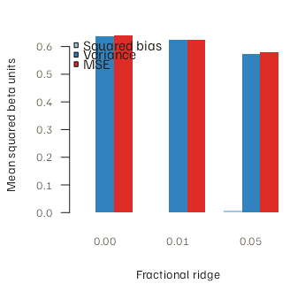
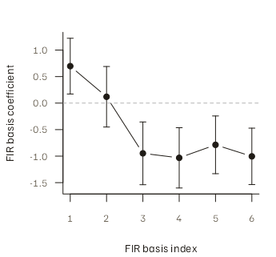

# Practical OASIS: Design, Regularization, and Diagnostics

The OASIS backend extends
[`lss()`](https://bbuchsbaum.github.io/fmrilss/reference/lss.md) to
event-based designs, multiple HRF bases, ridge regularization, and
model-based standard errors. It also processes voxel products in blocks
to limit temporary memory. This guide shows how to choose those options
and interpret the results. Start with
[`vignette("fmrilss")`](https://bbuchsbaum.github.io/fmrilss/articles/fmrilss.md)
for basic LSS; see
[`vignette("oasis_theory")`](https://bbuchsbaum.github.io/fmrilss/articles/oasis_theory.md)
for the derivation.

## Choose the estimator and output before fitting

| Goal | Required_choice |
|:---|:---|
| Exact ordinary LSS | ridge_x = ridge_b = 0; absolute mode makes the zero scale explicit |
| Regularized coefficients | absolute or fractional ridge; default is fractional 0.05 |
| Model-based coefficient SEs | zero ridge, fixed full-rank design, no estimated prewhitening |
| Multiple HRF bases | interpret K coefficients per trial; do not call them one amplitude |

OASIS choices that change the estimand or the available uncertainty.
{.table}

[`oasis_options()`](https://bbuchsbaum.github.io/fmrilss/reference/oasis_options.md)
uses ridge by default. Set both penalties to zero when comparing it with
an unpenalized LSS backend. Model-based standard errors
(`return_se = TRUE`) are unavailable with ridge, estimated prewhitening,
HRF-grid selection, or voxel-adaptive HRFs.

## Build a two-condition example

The example has one target condition, one explicitly modeled other
condition, a shared intercept and drift, heterogeneous target-trial
coefficients, and a fixed noise scale with independent, identically
distributed (iid) errors. Keeping the mean signal separate lets us
calculate the ridge bias–variance trade-off exactly for this design.

``` r

set.seed(20260811)
# Canonical HRF scaled to a unit peak, so betas are in units of peak response.
hrf_unit <- fmrihrf::normalise_hrf(fmrihrf::HRF_SPMG1)

n_time <- 180
n_voxels <- 6
TR <- 1
sframe <- fmrihrf::sampling_frame(blocklens = n_time, TR = TR)
times <- fmrihrf::samples(sframe, global = TRUE)

onsets_a <- c(10, 20, 31, 43, 56, 68, 81, 95, 108, 121, 135, 149)
onsets_b <- c(15, 37, 61, 86, 112, 141)
n_trials <- length(onsets_a)

design_spec <- list(
  sframe = sframe,
  cond = list(
    onsets = onsets_a,
    hrf = hrf_unit,
    duration = 0,
    amplitude = 1,
    span = 30
  ),
  others = list(list(
    onsets = onsets_b,
    hrf = hrf_unit,
    duration = 0,
    amplitude = 1,
    span = 30
  )),
  precision = 0.1,
  method = "conv"
)
```

We also construct the trial and other-condition regressors explicitly
for the simulation and independent GLM comparisons. In an analysis, `Y`
would normally be the observed time-by-voxel response rather than a
simulated matrix.

``` r

true_beta <- matrix(
  rnorm(n_trials * n_voxels, mean = 1, sd = 0.35),
  n_trials,
  n_voxels
)
other_beta <- matrix(seq(0.4, 0.9, length.out = n_voxels), 1L)
fixed_beta <- rbind(
  seq(-0.3, 0.3, length.out = n_voxels),
  seq(0.2, -0.2, length.out = n_voxels)
)
mean_signal <- X_trials %*% true_beta +
  X_other %*% other_beta +
  Z %*% fixed_beta
noise_sd <- 1.5
Y <- mean_signal + matrix(rnorm(n_time * n_voxels, sd = noise_sd),
                          n_time, n_voxels)
```

| Object                    | Rows | Columns |
|:--------------------------|-----:|--------:|
| Y                         |  180 |       6 |
| target trial design       |  180 |      12 |
| other-condition aggregate |  180 |       1 |
| fixed design              |  180 |       2 |

Objects used in the practical example. {.table}

## Fit from events

Put the condition whose trial coefficients you want in `cond`. Put
modeled conditions that should not become trial targets in `others`;
OASIS adds their aggregate basis columns to the regressors shared by
every trial model.

``` r

fit_default <- lss(
  Y = Y,
  X = NULL,
  Z = Z,
  method = "oasis",
  oasis = oasis_options(design_spec = design_spec)
)
dim(fit_default)
#> [1] 12  6
fit_default[1:4, 1:3]
#>           Voxel_1   Voxel_2    Voxel_3
#> Trial_1 1.5641689 1.7579667  1.8345523
#> Trial_2 1.4541214 0.3269049  1.8040081
#> Trial_3 0.8812229 0.3447504 -0.1357292
#> Trial_4 1.3235624 1.2075484 -0.9014281
```

The default result is an `n_trials` by `n_voxels` matrix because this is
a one-basis design. These are fractionally penalized coefficients.
Including condition B in `others` adjusts each target-trial estimate for
the B signal present in the simulation.

## Match ordinary LSS exactly when that is the target

Use explicit zero ridge. The verification assembles every corresponding
GLM independently as
`[target trial, other target trials, Z, condition B]` and checks all
trials and voxels.

``` r

fit_unpenalized <- lss(
  Y = Y,
  X = NULL,
  Z = Z,
  method = "oasis",
  oasis = oasis_options(
    design_spec = design_spec,
    ridge_mode = "absolute",
    ridge_x = 0,
    ridge_b = 0
  )
)
```

| Maximum_absolute_error |
|-----------------------:|
|                      0 |

Unpenalized OASIS versus independent trial-wise GLMs. {.table}

For a fixed one-basis `X`, this is the same estimand as the other
unpenalized LSS backends. OASIS is useful here because the event and
other-condition design can be constructed and checked in the same
workflow.

## Evaluate ridge on the scale you care about

Ridge reduces sampling variance by accepting bias. A smaller spread of
fitted trials is not, by itself, evidence of improvement. For this fixed
design, truth, and penalty, OASIS is linear in `Y`, so applying each fit
to the noise-free signal and to the identity matrix gives exact
conditional bias and variance under the iid noise model.

| Fractional_ridge | Mean_absolute_bias | Mean_squared_bias | Mean_variance | Mean_MSE | RMSE | Monte_Carlo_MSE |
|---:|---:|---:|---:|---:|---:|---:|
| 0.00 | 0.0345 | 0.0022 | 0.6371 | 0.6393 | 0.7996 | 0.6079 |
| 0.01 | 0.0380 | 0.0023 | 0.6231 | 0.6254 | 0.7908 | 0.6209 |
| 0.05 | 0.0747 | 0.0070 | 0.5717 | 0.5787 | 0.7607 | 0.5907 |

Exact conditional ridge metrics and a 100-repetition check for this
design, truth, and noise scale. {.table}



Exact squared bias, variance, and MSE for three fractional-ridge
settings in the fixed simulation; all bars use squared-beta units.

This is one scenario, not a universal ranking. Choose a ridge policy
using a simulation that matches the planned timing, basis, nuisance
structure, signal scale, and downstream loss. The package does not
justify generic penalty cutoffs from inter-stimulus interval alone. Even
the zero-penalty row has a small bias against the generating trial
effects: ordinary LSS gives all other target trials one shared
coefficient, while this simulation gives them heterogeneous
coefficients. The table therefore evaluates the full LSS estimator
against the generating effects, not merely ridge against an unpenalized
LSS reference.

## Inspect design diagnostics

`return_diag = TRUE` changes the return to a list. For a one-basis fit,
`d`, `alpha`, and `s` are the target energy, target–other cross-product,
and other-trial energy after projection.

``` r

fit_diag <- lss(
  Y,
  X_trials,
  Z = Z,
  Nuisance = X_other,
  method = "oasis",
  oasis = oasis_options(return_diag = TRUE)
)
diagnostics <- with(fit_diag$diag, data.frame(
  target_energy = d,
  other_energy = s,
  target_other_correlation = alpha / sqrt(d * s)
))
head(diagnostics, 4)
#>          target_energy other_energy target_other_correlation
#> trial_01      3.584692     20.70195               -0.2239838
#> trial_02      3.650588     21.49016               -0.2660595
#> trial_03      3.691278     21.65657               -0.2751521
#> trial_04      3.754391     21.39954               -0.2636462
```

These are unpenalized cross-products on the residualized design scale.
They are useful for finding low-energy or highly correlated trials, but
they are not a condition number, a ridge calibration, or an inferential
test.

## Interpret multi-basis coefficients

An event-built SPMG3 design has three rows per trial: canonical,
temporal derivative, and dispersion-derivative coefficients in that
basis. Their scale depends on the basis definition.

``` r

spec_spmg3 <- design_spec
spec_spmg3$cond$hrf <- fmrihrf::HRF_SPMG3
spec_spmg3$others[[1]]$hrf <- fmrihrf::HRF_SPMG3

fit_spmg3 <- lss(
  Y,
  X = NULL,
  Z = Z,
  method = "oasis",
  oasis = oasis_options(design_spec = spec_spmg3, return_diag = TRUE)
)
K_spmg3 <- 3L
c(rows = nrow(fit_spmg3$beta), trials = n_trials, basis_dimension = K_spmg3)
#>            rows          trials basis_dimension 
#>              36              12               3
rownames(fit_spmg3$beta)[1:6]
#> [1] "Trial_1:Basis_1" "Trial_1:Basis_2" "Trial_1:Basis_3" "Trial_2:Basis_1"
#> [5] "Trial_2:Basis_2" "Trial_2:Basis_3"
```

For `N` trials, `K` basis functions, and `V` voxels, the output is `NK`
by `V`: each trial has `K` consecutive rows in basis order. Keep the row
names or reshape explicitly; do not infer a scalar response amplitude
from the canonical row alone unless a separate normalization and
estimand justify that operation.

If you already have a raw multi-basis matrix, supply the trial and basis
identity of every column. `X_multi` must have unique, non-empty column
names, and the map must identify every column with one exact-integer
trial and basis pair. OASIS canonicalizes the matrix to trial-major,
basis-minor order and attaches the canonical map to the returned beta
matrix.

Here we construct the source matrix in trial-major, basis-minor order
and record those identities *before* deliberately permuting its columns.
For a different upstream design, use that producer’s metadata; never
infer identity from the order in which an arbitrary matrix happens to
arrive.

``` r

K <- K_spmg3
source_map <- data.frame(
  column = sprintf("source_%02d", seq_len(ncol(X_spmg3_source))),
  trial = rep(seq_len(n_trials), each = K),
  basis = rep(seq_len(K), times = n_trials)
)
colnames(X_spmg3_source) <- source_map$column

column_order <- rev(seq_len(ncol(X_spmg3_source)))
X_multi <- X_spmg3_source[, column_order, drop = FALSE]

fit_raw_multi <- lss(
  Y,
  X_multi,
  Z = Z,
  Nuisance = X_other_spmg3,
  method = "oasis",
  oasis = oasis_options(
    K = K,
    ntrials = n_trials,
    trial_basis_map = source_map,
    return_diag = TRUE
  )
)
raw_permutation_error <- max(abs(fit_raw_multi$beta - fit_spmg3$beta))
c(maximum_beta_error = raw_permutation_error)
#> maximum_beta_error 
#>                  0
head(attr(fit_raw_multi$beta, "trial_basis_map"), 3)
#>      column trial basis     output_name
#> 1 source_01     1     1 Trial_1:Basis_1
#> 2 source_02     1     2 Trial_1:Basis_2
#> 3 source_03     1     3 Trial_1:Basis_3
```

Without optional returns, OASIS returns the `NK` by `V` beta matrix.
Setting `return_diag = TRUE` or `return_se = TRUE` returns a list
containing `beta`, then `diag` when requested, then `se` when requested.
`beta` and `se` are both `NK` by `V`. For `K = 1`, `diag` contains
vectors `d`, `alpha`, and `s`, each of length `N`. For `K > 1`, it
contains `D`, `C`, and `E` arrays of shape `K` by `K` by `N`.
Diagnostics describe the residualized design, or the
whitened-and-residualized design when whitening is active.

## Standard errors require the unpenalized fixed-design model

To check the standard errors (SEs), generate data that satisfy each LSS
model: all target trials share a common coefficient vector, condition B
and `Z` are in the fitted common span, and the temporal errors are iid
Gaussian.

``` r

fit_se <- lss(
  Y_se,
  X_trials,
  Z = Z,
  Nuisance = X_other,
  method = "oasis",
  oasis = oasis_options(
    ridge_mode = "absolute",
    ridge_x = 0,
    ridge_b = 0,
    return_se = TRUE
  )
)
dim(fit_se$beta)
#> [1] 12  6
dim(fit_se$se)
#> [1] 12  6
```

| Maximum_beta_error | Maximum_SE_error |
|-------------------:|-----------------:|
|                  0 |                0 |

OASIS beta and SE agreement with independent full GLMs. {.table}

These SEs describe coefficient uncertainty conditional on the fixed
design and uncorrelated, constant-variance temporal errors. They do not
account for autocorrelation or heteroskedasticity, and they do not
provide a multiple-testing or population-inference procedure. Estimated
whitening cannot be combined with `return_se = TRUE`.

## FIR coefficients and their uncertainty

A finite impulse response (FIR) design also returns basis coefficients
for each trial and voxel. The next plot shows one trial in one voxel,
with one model SE for each coefficient. These intervals describe
individual coefficients; they do not describe uncertainty in an average
HRF across trials or voxels. The data generator uses a correctly
specified FIR target-plus-other-trials model with iid Gaussian errors,
and the verification assembles every corresponding GLM independently.

``` r

fit_fir <- lss(
  Y_fir,
  X = NULL,
  Z = Z,
  method = "oasis",
  oasis = oasis_options(
    design_spec = spec_fir,
    ridge_mode = "absolute",
    ridge_x = 0,
    ridge_b = 0,
    return_se = TRUE
  )
)
dim(fit_fir$beta)
#> [1] 72  6
dim(fit_fir$se)
#> [1] 72  6
```

| Maximum_beta_error | Maximum_SE_error |
|-------------------:|-----------------:|
|                  0 |                0 |

FIR beta and SE agreement with independent full GLMs. {.table}



FIR basis coefficients plus or minus one conditional model SE for trial
1, voxel 1; the y-axis is coefficient scale, not a normalized HRF
amplitude.

FIR models can be poorly conditioned because each trial contributes many
columns. Ridge may help stabilize the fit, but the package does not
report model SEs for penalized FIR coefficients.

## HRF-grid selection is exploratory

`hrf_grid` chooses one candidate from the observed `Y` using a
matched-filter score after residualizing both the response and candidate
against the full common span (`Z`, `Nuisance`, and modeled `others`),
then fits that design. The call shown returns the beta matrix. Even when
design diagnostics are requested, the public
[`lss()`](https://bbuchsbaum.github.io/fmrilss/reference/lss.md) route
does not expose the winning candidate or candidate scores, and it does
not return selection-adjusted uncertainty.

``` r

grid_spec <- design_spec
grid_spec$hrf_grid <- list(fmrihrf::HRF_SPMG1, fmrihrf::HRF_GAMMA)

fit_grid <- lss(
  Y,
  X = NULL,
  Z = Z,
  method = "oasis",
  oasis = oasis_options(
    design_spec = grid_spec,
    ridge_mode = "fractional",
    ridge_x = 0.01,
    ridge_b = 0.01
  )
)
dim(fit_grid)
#> [1] 12  6
```

The next simulation checks whether HRF selection accounts for the common
regressors. Its target signal is Gaussian, while a much stronger
other-condition signal uses SPMG1. The grid fit must match the otherwise
identical fit with the Gaussian target fixed in advance.

| Maximum_Gaussian_reference_error |
|---------------------------------:|
|                                0 |

Grid fit versus the fixed-Gaussian reference after conditioning on a
strong SPMG1 other condition. {.table}

Because selection and estimation use the same data, treat this as
exploratory or validate the selection out of sample. This route rejects
`return_se = TRUE` because it does not account for selection
uncertainty. For explicitly normalized voxel-specific shapes, continue
to
[`vignette("voxel-wise-hrf")`](https://bbuchsbaum.github.io/fmrilss/articles/voxel-wise-hrf.md).

## Prewhitening changes the fitted space

Use the top-level `prewhiten` argument. The same estimated operator is
applied to the response, target design, and common design before OASIS
fits coefficients.

``` r

set.seed(20260814)
ar_error <- apply(matrix(rnorm(n_time * n_voxels), n_time), 2, function(x) {
  as.numeric(stats::filter(x, filter = 0.6, method = "recursive"))
})
Y_ar <- mean_signal + ar_error

pw_ar <- prewhiten_options(method = "ar", p = 1, pooling = "global")

fit_ar <- lss(
  Y_ar,
  X_trials,
  Z = Z,
  Nuisance = X_other,
  method = "oasis",
  oasis = oasis_options(
    ridge_mode = "absolute",
    ridge_x = 0,
    ridge_b = 0
  ),
  prewhiten = pw_ar
)
dim(fit_ar)
#> [1] 12  6
```

| Maximum_backend_error |
|----------------------:|
|                     0 |

Unpenalized OASIS versus the naive backend after the same estimated
whitening. {.table}

This example demonstrates how to fit coefficients after whitening; it
does not establish that AR(1) is adequate for every dataset. Choose the
order and pooling from residual diagnostics and the study design. A
shared OASIS design supports global or run-level operators; voxel- and
parcel-specific operators are rejected because they cannot be applied to
one shared design matrix.

``` r

run_lengths <- c(90L, 90L)
run_id <- rep(seq_along(run_lengths), times = run_lengths)
runwise <- prewhiten_options(
  method = "ar",
  p = 1,
  pooling = "run",
  runs = run_id
)
length(run_id)
#> [1] 180
```

Always provide run labels when data span multiple runs so filtering does
not cross run boundaries. `pooling = "global"` with `runs` uses one
shared set of noise coefficients while still respecting those
boundaries; `pooling = "run"` estimates a separate set for each run.
Estimated-prewhitening uncertainty is not calibrated, so this
coefficient route cannot also request OASIS model SEs.

## A compact decision guide

- Use a standard LSS backend for a fixed one-basis `X` when you want the
  basic unpenalized fit.
- Use OASIS for event construction, modeled other conditions, multiple
  bases, ridge, blocked products, or fixed-design model SEs.
- Ridge, HRF selection, and estimated whitening change the estimator and
  the interpretation of its uncertainty.
- Preserve row names and trial/basis identity whenever $`K>1`$.

## Next steps

- [`vignette("oasis_theory")`](https://bbuchsbaum.github.io/fmrilss/articles/oasis_theory.md)
  — derivation, complexity, memory, and inference boundaries
- [`vignette("lss_with_fmridesign")`](https://bbuchsbaum.github.io/fmrilss/articles/lss_with_fmridesign.md)
  — run-aware event-table construction
- [`vignette("voxel-wise-hrf")`](https://bbuchsbaum.github.io/fmrilss/articles/voxel-wise-hrf.md)
  — normalized voxel-specific HRF shapes
- [`vignette("sbhm")`](https://bbuchsbaum.github.io/fmrilss/articles/sbhm.md)
  — library-constrained voxel-specific HRFs

## Reference

Mumford, J. A., Turner, B. O., Ashby, F. G., & Poldrack, R. A. (2012).
Deconvolving BOLD activation in event-related designs for multivoxel
pattern classification analyses. *NeuroImage*, 59(3), 2636–2643.
<https://doi.org/10.1016/j.neuroimage.2011.08.076>
