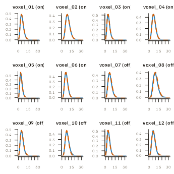
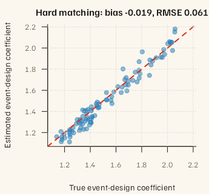

# Shared-basis HRF matching: shapes, score margins, and trial coefficients

## What this workflow estimates

Shared-basis HRF matching (SBHM) selects a voxel’s HRF from a finite
library or forms an explicitly requested blend of library members. It
provides an alternative to the continuous basis fit in
[`vignette("voxel-wise-hrf")`](https://bbuchsbaum.github.io/fmrilss/articles/voxel-wise-hrf.md).
Read that article,
[`vignette("fmrilss")`](https://bbuchsbaum.github.io/fmrilss/articles/fmrilss.md),
and
[`vignette("oasis_method")`](https://bbuchsbaum.github.io/fmrilss/articles/oasis_method.md)
first for HRF normalization and trial estimation.

SBHM estimates two quantities separately:

1.  a voxel-specific HRF **shape coordinate** in a shared basis; and
2.  a trial-wise **coefficient on the event design built from that
    shape**.

The coefficient is not automatically a peak BOLD response. With
`normalize = TRUE`,
[`sbhm_build()`](https://bbuchsbaum.github.io/fmrilss/reference/sbhm_build.md)
normalizes each candidate to discrete unit $`L_2`$ energy before rank
truncation. The returned coefficient is therefore on the scale of the
selected rank-truncated waveform and the supplied event duration and
amplitude. Changing any of those changes the coefficient scale.

SBHM produces adaptive point estimates. Shape matching, optional
blending, ridge penalties, and reuse of the same data for shape
selection and coefficient estimation are not accounted for by calibrated
standard errors or test statistics. Every SBHM amplitude route rejects
`return_se = TRUE`.

``` r

suppressPackageStartupMessages({
  library(fmrihrf)
  library(fmrilss)
})
```

``` r

contract <- data.frame(
  Object = c("Library", "Shared basis", "Shape match", "Trial output", "Uncertainty"),
  Contract = c(
    "Finite, uniquely named candidate waveforms; optional discrete-L2 normalization",
    "Rank-r SVD representation with total-energy and numerical-rank metadata",
    "Hard candidate or explicit soft blend; margin is an uncalibrated score difference",
    "Coefficient on the supplied event design using the selected rank-truncated shape",
    "Point estimates only; SBHM standard errors and tests are not calibrated"
  )
)
knitr::kable(contract, caption = "The estimands and boundaries used throughout this article.")
```

| Object | Contract |
|:---|:---|
| Library | Finite, uniquely named candidate waveforms; optional discrete-L2 normalization |
| Shared basis | Rank-r SVD representation with total-energy and numerical-rank metadata |
| Shape match | Hard candidate or explicit soft blend; margin is an uncalibrated score difference |
| Trial output | Coefficient on the supplied event design using the selected rank-truncated shape |
| Uncertainty | Point estimates only; SBHM standard errors and tests are not calibrated |

The estimands and boundaries used throughout this article. {.table}

## Build a candidate library

For a compact computational example, we use a grid of positive gamma
curves. These curves illustrate the computation; they are not intended
to cover the range of physiological HRFs. For a scientific analysis,
choose candidates and preprocessing appropriate to the responses you
expect.

``` r

TR <- 1
n_time <- 180L
sframe <- sampling_frame(blocklens = n_time, TR = TR)
time <- samples(sframe, global = TRUE)
span <- 32

library_grid <- expand.grid(
  shape = c(5, 6.5, 8, 9.5),
  rate = c(0.85, 1.00, 1.15)
)
library_H <- vapply(seq_len(nrow(library_grid)), function(i) {
  h <- dgamma(time, shape = library_grid$shape[i], rate = library_grid$rate[i])
  h[time > span] <- 0
  h
}, numeric(length(time)))
colnames(library_H) <- sprintf(
  "gamma_s%02d_r%03d",
  round(10 * library_grid$shape), round(100 * library_grid$rate)
)

rank_used <- 4L
sbhm <- sbhm_build(
  library_H = library_H,
  r = rank_used,
  tgrid = time,
  span = span,
  normalize = TRUE,
  baseline = NULL,
  ref = "mean"
)
```

### Rank is a declared approximation

[`sbhm_build()`](https://bbuchsbaum.github.io/fmrilss/reference/sbhm_build.md)
performs one decomposition and retains the full singular-value spectrum
as metadata. The cumulative fraction below uses the sum of squared
singular values across the full spectrum as its denominator. We retain
rank four for this example; the table shows how much library energy that
choice preserves.

``` r

singular_values <- sbhm$meta$singular_values_full
rank_table <- data.frame(
  Rank = seq_along(singular_values),
  CumulativeEnergy = cumsum(singular_values^2) / sum(singular_values^2),
  RelativeResidual = sqrt(
    pmax(0, 1 - cumsum(singular_values^2) / sum(singular_values^2))
  )
)
rank_table <- head(rank_table, 6)
rank_table$CumulativeEnergy <- round(rank_table$CumulativeEnergy, 6)
rank_table$RelativeResidual <- round(rank_table$RelativeResidual, 6)
knitr::kable(
  rank_table,
  caption = "Total library energy retained and relative Frobenius residual by rank."
)
```

| Rank | CumulativeEnergy | RelativeResidual |
|-----:|-----------------:|-----------------:|
|    1 |         0.805168 |         0.441398 |
|    2 |         0.972669 |         0.165321 |
|    3 |         0.997154 |         0.053345 |
|    4 |         0.999824 |         0.013274 |
|    5 |         0.999991 |         0.003067 |
|    6 |         1.000000 |         0.000311 |

Total library energy retained and relative Frobenius residual by rank.
{.table}

The shared basis `B` is orthonormal on this sampled grid. The
coordinates `A` reconstruct the rank-four candidate waveforms as
`B %*% A`; basis vectors are algebraic modes, not direct estimates of
latency, width, or physiology.

## Simulate known shapes and trial coefficients

The simulation contains twelve voxels. Six use an exact library member
and six use an off-library convex mixture. This tests both interpolation
and the limitation of hard matching. Trial coefficients vary across
trials and voxels. Motion-like nuisance signals and independent Gaussian
noise are added explicitly.

``` r

n_voxels <- 12L
voxel_names <- paste0("voxel_", sprintf("%02d", seq_len(n_voxels)))
onsets <- seq(12, 138, length.out = 8)
n_trials <- length(onsets)
trial_names <- paste0("event_", sprintf("%02d", seq_len(n_trials)))
design_spec <- list(
  sframe = sframe,
  cond = list(
    onsets = onsets,
    duration = 0,
    amplitude = 1,
    span = span,
    trial_names = trial_names
  ),
  precision = 0.1,
  method = "conv"
)

on_library_idx <- c(1L, 3L, 5L, 7L, 9L, 11L)
alpha_true <- matrix(NA_real_, rank_used, n_voxels)
alpha_true[, 1:6] <- sbhm$A[, on_library_idx, drop = FALSE]
mix_pairs <- rbind(c(1, 2), c(3, 4), c(5, 6), c(7, 8), c(9, 10), c(11, 12))
mix_weight <- c(0.25, 0.40, 0.55, 0.70, 0.35, 0.60)
for (v in 1:6) {
  alpha_true[, 6 + v] <-
    mix_weight[v] * sbhm$A[, mix_pairs[v, 1]] +
    (1 - mix_weight[v]) * sbhm$A[, mix_pairs[v, 2]]
}
colnames(alpha_true) <- voxel_names

hrf_B <- sbhm_hrf(sbhm$B, sbhm$tgrid, sbhm$span)
trial_regs <- lapply(seq_along(onsets), function(j) {
  rr <- regressor(
    onsets = onsets[j], hrf = hrf_B,
    duration = 0, amplitude = 1, span = span, summate = FALSE
  )
  as.matrix(evaluate(rr, grid = time, precision = 0.1, method = "conv"))
})

trial_index <- seq_len(n_trials)
voxel_index <- seq_len(n_voxels)
beta_true <- outer(trial_index, voxel_index, function(i, v) {
  1.6 + 0.35 * sin(i / 1.7 + v / 4) + 0.12 * cos(i * v / 5)
})
dimnames(beta_true) <- list(trial_names, voxel_names)

Nuisance <- cbind(
  linear = seq(-1, 1, length.out = n_time),
  slow_sine = sin(2 * pi * time / max(time))
)
nuisance_coef <- rbind(
  seq(-0.25, 0.25, length.out = n_voxels),
  seq(0.20, -0.20, length.out = n_voxels)
)
Y_mean <- matrix(2, n_time, n_voxels) + Nuisance %*% nuisance_coef
for (v in seq_len(n_voxels)) {
  for (j in seq_len(n_trials)) {
    Y_mean[, v] <- Y_mean[, v] +
      beta_true[j, v] * as.numeric(trial_regs[[j]] %*% alpha_true[, v])
  }
}
set.seed(812)
Y <- Y_mean + matrix(rnorm(n_time * n_voxels, sd = 0.04), n_time, n_voxels)
colnames(Y) <- voxel_names
```

We first fit with hard matching and zero penalties. Zero penalties allow
a direct comparison with an unpenalized GLM using the selected shape.
Later we compare hard matching with soft matching on the same data.

``` r

fit_hard <- lss_sbhm(
  Y = Y,
  sbhm = sbhm,
  design_spec = design_spec,
  Nuisance = Nuisance,
  prepass = list(ridge = list(mode = "absolute", lambda = 0)),
  match = list(topK = 1, soft_blend = FALSE, whiten = FALSE),
  oasis = list(ridge_mode = "absolute", ridge_x = 0, ridge_b = 0),
  amplitude = list(method = "global_ls", ridge = 0),
  return = "both"
)
```

``` r

output_contract <- data.frame(
  Component = c(
    "alpha_coords", "amplitude", "coeffs_r", "matched_name", "shape_mode",
    "event_amplitude / event_duration"
  ),
  Shape = c(
    paste(dim(fit_hard$alpha_coords), collapse = " x "),
    paste(dim(fit_hard$amplitude), collapse = " x "),
    paste(dim(fit_hard$coeffs_r), collapse = " x "),
    as.character(length(fit_hard$matched_name)),
    as.character(length(fit_hard$shape_mode)),
    paste(length(fit_hard$event_amplitude), "/", length(fit_hard$event_duration))
  ),
  Meaning = c(
    "rank x voxel coordinates actually used by the amplitude refit",
    "trial x voxel event-design coefficients",
    "rank x trial x voxel OASIS coefficients",
    "top-scoring library candidate for each voxel",
    "hard, soft, or fallback shape policy actually used",
    "named event-design scale metadata aligned with amplitude rows"
  )
)
knitr::kable(output_contract, caption = "SBHM outputs for the simulated data.")
```

| Component | Shape | Meaning |
|:---|:---|:---|
| alpha_coords | 4 x 12 | rank x voxel coordinates actually used by the amplitude refit |
| amplitude | 8 x 12 | trial x voxel event-design coefficients |
| coeffs_r | 4 x 8 x 12 | rank x trial x voxel OASIS coefficients |
| matched_name | 12 | top-scoring library candidate for each voxel |
| shape_mode | 12 | hard, soft, or fallback shape policy actually used |
| event_amplitude / event_duration | 8 / 8 | named event-design scale metadata aligned with amplitude rows |

SBHM outputs for the simulated data. {.table}

## Evaluate the shape actually used

Exact library index is secondary: nearby candidates can have almost
identical waveforms. We therefore evaluate `B %*% alpha_coords` for
every voxel. Angular error is zero for identical waveform direction and
ignores arbitrary positive scale. Unit-norm waveform RMSE adds a
time-domain discrepancy.

``` r

shape_summary_display <- shape_summary
shape_summary_display[-1] <- lapply(shape_summary_display[-1], round, 5)
knitr::kable(
  shape_summary_display,
  caption = "All-voxel hard-match waveform error, separated by library coverage."
)
```

| Truth | MeanAngularErrorRadians | MaxAngularErrorRadians | MeanUnitWaveformRMSE |
|:---|---:|---:|---:|
| Off-library | 0.09139 | 0.14766 | 0.00681 |
| On-library | 0.00000 | 0.00000 | 0.00000 |

All-voxel hard-match waveform error, separated by library coverage.
{.table}

``` r

local({
  oldpar <- par(mfrow = c(3, 4), mar = c(2.7, 2.8, 2.1, 0.6), bg = "white")
  on.exit(par(oldpar), add = TRUE)
  keep <- time <= span
  for (v in seq_len(n_voxels)) {
    ylim <- range(true_waveforms[keep, v], hard_waveforms[keep, v])
    plot(time[keep], true_waveforms[keep, v], type = "l", lwd = 2,
         col = "#2c7fb8", ylim = ylim, xlab = "Seconds", ylab = "Shape",
         main = paste0(voxel_names[v], if (v <= 6) " (on)" else " (off)"))
    lines(time[keep], hard_waveforms[keep, v], lwd = 2, lty = 2, col = "#d95f02")
    abline(h = 0, col = "gray85")
  }
})
```



True and hard-matched rank-four waveforms for every voxel. Solid blue is
truth; dashed orange is the coordinate actually used by the amplitude
refit. Panels marked ‘(off)’ contain off-library mixtures and are
intentionally harder.

For the six voxels generated from library members, we can also check
whether the selected index matches the generating index:

``` r

exact_index_accuracy <- mean(
  fit_hard$matched_name[1:6] == colnames(sbhm$A)[on_library_idx]
)
data.frame(OnLibraryExactCandidateAccuracy = exact_index_accuracy)
#>   OnLibraryExactCandidateAccuracy
#> 1                               1
```

## Hard and soft matching answer different questions

Soft matching blends candidate coordinates using softmax weights derived
from cosine scores. These weights are not estimates of the mixture
fractions used to generate the data, and the score margin is not a
confidence measure. The comparison below shows how hard and soft
matching perform in this simulation; it does not establish a general
advantage for either method.

``` r

fit_soft <- lss_sbhm(
  Y = Y,
  sbhm = sbhm,
  design_spec = design_spec,
  Nuisance = Nuisance,
  prepass = list(ridge = list(mode = "absolute", lambda = 0)),
  match = list(
    topK = 3, soft_blend = TRUE, blend_margin = 2,
    whiten = FALSE
  ),
  oasis = list(ridge_mode = "absolute", ridge_x = 0, ridge_b = 0),
  amplitude = list(method = "global_ls", ridge = 0),
  return = "both"
)
```

``` r

soft_shape_by_voxel <- waveform_metrics(fit_soft$alpha_coords, alpha_true, sbhm$B)
policy_table <- rbind(
  data.frame(
    Policy = "Hard top-1",
    VoxelsUsingPolicy = sum(fit_hard$shape_mode == "hard"),
    MeanAngularError = mean(hard_shape_by_voxel$AngularErrorRadians),
    AmplitudeBias = mean(fit_hard$amplitude - beta_true),
    AmplitudeRMSE = sqrt(mean((fit_hard$amplitude - beta_true)^2))
  ),
  data.frame(
    Policy = "Soft top-3",
    VoxelsUsingPolicy = sum(fit_soft$shape_mode == "soft"),
    MeanAngularError = mean(soft_shape_by_voxel$AngularErrorRadians),
    AmplitudeBias = mean(fit_soft$amplitude - beta_true),
    AmplitudeRMSE = sqrt(mean((fit_soft$amplitude - beta_true)^2))
  )
)
policy_table[-1] <- lapply(policy_table[-1], round, 5)
knitr::kable(
  policy_table,
  caption = "Hard and soft matching compared with the known simulated shapes and coefficients."
)
```

| Policy     | VoxelsUsingPolicy | MeanAngularError | AmplitudeBias | AmplitudeRMSE |
|:-----------|------------------:|-----------------:|--------------:|--------------:|
| Hard top-1 |                12 |          0.04569 |      -0.01927 |       0.06106 |
| Soft top-3 |                12 |          0.06821 |      -0.00646 |       0.06817 |

Hard and soft matching compared with the known simulated shapes and
coefficients. {.table}

The returned `margin` is the difference between the highest and
second-highest cosine scores. Low margin can reveal near-ties, but no
universal `min_margin` or `blend_margin` follows from it. If gating is
used, inspect `shape_mode` and `fallback_low_conf`; `matched_name`
remains the top-scoring candidate, whereas `alpha_coords` records the
shape actually used.

## Compare trial coefficients with a direct GLM fit

With `amplitude$method = "global_ls"` and zero ridge, the final stage is
an ordinary GLM that fits all trial columns jointly, conditional on the
selected shape. The comparison below constructs each voxel’s model
independently using public `fmrihrf` regressors. Agreement checks the
coefficient calculation for these selected shapes; it does not remove
shape-selection bias.

``` r

amplitude_display <- amplitude_table
amplitude_display[-1] <- lapply(amplitude_display[-1], round, 5)
amplitude_display$DirectGLMMaxError <- c(NA, format(direct_error, scientific = TRUE), NA)
knitr::kable(
  amplitude_display,
  caption = "Trial-coefficient recovery and the independent all-cell GLM identity check."
)
```

| Estimator                |     Bias |    RMSE | DirectGLMMaxError |
|:-------------------------|---------:|--------:|:------------------|
| Known truth shape        |  0.00041 | 0.05007 | NA                |
| SBHM hard-selected shape | -0.01927 | 0.06106 | 2.220446e-15      |
| SBHM soft-selected shape | -0.00646 | 0.06817 | NA                |

Trial-coefficient recovery and the independent all-cell GLM identity
check. {.table}

``` r

plot(
  as.vector(beta_true), as.vector(fit_hard$amplitude),
  pch = 19, col = grDevices::adjustcolor("#2c7fb8", alpha.f = 0.55),
  xlim = amp_range, ylim = amp_range,
  xlab = "True event-design coefficient",
  ylab = "Estimated event-design coefficient",
  main = sprintf("Hard matching: bias %.3f, RMSE %.3f", amp_bias, amp_rmse)
)
abline(0, 1, col = "#d7301f", lwd = 2, lty = 2)
grid()
```



Hard-match event-design coefficients against truth for all trials and
voxels. The red dashed line is equality; the displayed bias and RMSE are
conditional on this fixed simulation.

## Use a factorization for the initial shape calculation

`data_fac` represents `Y` as `scores %*% loadings`, where scores are
$`T \times q`$ and loadings are $`q \times V`$. The full `Y` is still
required by
[`lss_sbhm()`](https://bbuchsbaum.github.io/fmrilss/reference/lss_sbhm.md)
for OASIS and the amplitude stage. The shortcut therefore reduces
multiplication in the initial shape calculation (the prepass); the full
pipeline still depends on $`V`$. Named factor axes must agree between
scores and loadings; when `Y` has voxel names, loadings must carry the
same names and are aligned before use. Active prewhitening with
`data_fac` fails explicitly because the supplied factorization is not a
factorization of the estimated whitened data.

``` r

set.seed(813)
q <- 4L
scores <- matrix(rnorm(n_time * q), n_time, q)
loadings <- matrix(rnorm(q * n_voxels), q, n_voxels)
colnames(scores) <- rownames(loadings) <- paste0("factor_", seq_len(q))
colnames(loadings) <- voxel_names
Y_factorized <- scores %*% loadings
colnames(Y_factorized) <- voxel_names

pre_dense <- sbhm_prepass(
  Y_factorized, sbhm, design_spec,
  ridge = list(mode = "absolute", lambda = 0)
)
pre_factorized <- sbhm_prepass(
  Y_factorized, sbhm, design_spec,
  ridge = list(mode = "absolute", lambda = 0),
  data_fac = list(scores = scores, loadings = loadings)
)
factorized_error <- max(abs(pre_dense$beta_bar - pre_factorized$beta_bar))
data.frame(
  Scores = paste(dim(scores), collapse = " x "),
  Loadings = paste(dim(loadings), collapse = " x "),
  Voxels = ncol(Y_factorized),
  DenseVsFactorizedMaxError = factorized_error
)
#>    Scores Loadings Voxels DenseVsFactorizedMaxError
#> 1 180 x 4   4 x 12     12              1.332268e-15
```

For a PCA factorization, `prcomp(Y)$x` supplies scores and
`t(prcomp(Y)$rotation)` supplies the required $`q \times V`$ loading
orientation. The evaluated path below keeps `Y` as the response for
OASIS and the amplitude stage while using a rank-four uncentered PCA
approximation only for the prepass. This is a computational
approximation, not an accuracy claim.

``` r

pca <- prcomp(Y, center = FALSE, scale. = FALSE, rank. = q)
pca_scores <- pca$x[, seq_len(q), drop = FALSE]
pca_loadings <- t(pca$rotation[, seq_len(q), drop = FALSE])

fit_pca_prepass <- lss_sbhm(
  Y = Y,
  sbhm = sbhm,
  design_spec = design_spec,
  Nuisance = Nuisance,
  prepass = list(
    ridge = list(mode = "absolute", lambda = 0),
    data_fac = list(scores = pca_scores, loadings = pca_loadings)
  ),
  match = list(topK = 1, soft_blend = FALSE, whiten = FALSE),
  oasis = list(ridge_mode = "absolute", ridge_x = 0, ridge_b = 0),
  amplitude = list(method = "global_ls", ridge = 0),
  return = "amplitude"
)
data.frame(
  ScoreShape = paste(dim(pca_scores), collapse = " x "),
  LoadingShape = paste(dim(pca_loadings), collapse = " x "),
  FullResponseShape = paste(dim(Y), collapse = " x "),
  OutputShape = paste(dim(fit_pca_prepass$amplitude), collapse = " x ")
)
#>   ScoreShape LoadingShape FullResponseShape OutputShape
#> 1    180 x 4       4 x 12          180 x 12      8 x 12
```

## Runs, conditions, and whitening

Raw multi-run `design_spec` inputs use run-relative onsets and an
explicit `cond$run` vector. SBHM constructs every trial inside its own
sampling-frame run and uses run-specific intercepts, so an HRF tail
cannot cross a run boundary.
[`lss_sbhm_design()`](https://bbuchsbaum.github.io/fmrilss/reference/lss_sbhm_design.md)
obtains those run identities and heterogeneous durations from the unique
trialwise `fmridesign` term; non-trial event terms and baseline-model
columns enter the fixed nuisance span. See
[`vignette("lss_with_fmridesign")`](https://bbuchsbaum.github.io/fmrilss/articles/lss_with_fmridesign.md)
for how event models preserve trial identity.

If estimated prewhitening is requested, SBHM applies the same
transformation to the response, trial basis, other-condition span, and
nuisance design in the prepass, diagnostics, and final amplitude
estimator. The whitening plan is estimated once from the complete trial
and common design, then reused at every stage. For a multi-run sampling
frame, omitted `prewhiten$runs` are filled from the frame’s run
boundaries; contradictory labels fail rather than allowing a temporal
filter to bridge runs. This changes the conditional point estimator; it
does not create calibrated post-selection standard errors. Factorized
prepasses and active prewhitening cannot be combined.

## Advanced policies are explicit heuristics

`alpha_source = "trial_projection"` and `"oasis_rank1"`, low-score
fallback, condition gates, ridge penalties, and adaptive ridge controls
are available for specialized studies. They change the estimator. No
rank, ridge fraction, margin threshold, ISI boundary, or TR cutoff is
generally recommended here. Choose and validate such a policy against
the design, signal scale, failure modes, and loss function of the
intended analysis.

The three scalar-coefficient engines also answer different model
questions:

- `global_ls` fits all trial columns jointly for each selected voxel
  shape;
- `lss1` fits one target and one aggregate-other column per trial;
- `oasis_voxel` applies the K=1 OASIS operator per voxel.

Exactly coincident or otherwise unidentified trials cannot be recovered
by any of these labels. Ridge may return symmetric finite coefficients,
but it does not restore identification. None of the three engines
returns calibrated SBHM standard errors.

## Applying SBHM to your data

Choose the library and retained rank by examining the waveforms they can
represent. Inspect the waveform reconstructed from `alpha_coords`,
retain the trial and voxel identity maps, and interpret coefficients in
the units of the supplied event design. Evaluate matching, fallback,
ridge, and whitening choices against known truth or external calibration
suited to your analysis.

See
[`?sbhm_build`](https://bbuchsbaum.github.io/fmrilss/reference/sbhm_build.md),
[`?sbhm_match`](https://bbuchsbaum.github.io/fmrilss/reference/sbhm_match.md),
[`?sbhm_prepass`](https://bbuchsbaum.github.io/fmrilss/reference/sbhm_prepass.md),
[`?lss_sbhm`](https://bbuchsbaum.github.io/fmrilss/reference/lss_sbhm.md),
and
[`?lss_sbhm_design`](https://bbuchsbaum.github.io/fmrilss/reference/lss_sbhm_design.md)
for the complete interfaces. For library HRF selection combined with
GLMdenoise and cross-validated ridge, see
[`vignette("glmsingle")`](https://bbuchsbaum.github.io/fmrilss/articles/glmsingle.md).
