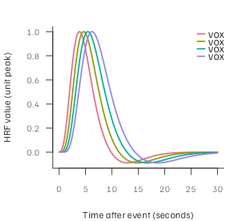
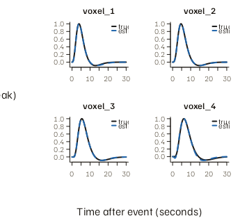

# Voxel-wise HRF shapes and trial coefficients

[`estimate_voxel_hrf()`](https://bbuchsbaum.github.io/fmrilss/reference/estimate_voxel_hrf.md)
estimates one HRF shape per voxel;
[`lss_with_hrf()`](https://bbuchsbaum.github.io/fmrilss/reference/lss_with_hrf.md)
then uses those shapes to estimate one LSS coefficient per trial and
voxel. Because each shape is normalized to a peak of one, the
coefficient for a unit-amplitude impulse event is the trial’s
peak-response amplitude. Read this after
[`vignette("fmrilss")`](https://bbuchsbaum.github.io/fmrilss/articles/fmrilss.md),
[`vignette("oasis_method")`](https://bbuchsbaum.github.io/fmrilss/articles/oasis_method.md),
and
[`vignette("lss_with_fmridesign")`](https://bbuchsbaum.github.io/fmrilss/articles/lss_with_fmridesign.md).

``` r

suppressPackageStartupMessages({
  library(fmrilss)
  library(fmrihrf)
})
```

## Fix the HRF scale before interpreting a beta

HRF shape and response amplitude are not jointly identified without a
scale convention: multiplying an HRF by $`c`$ and dividing its beta by
$`c`$ leaves the fitted signal unchanged.
[`estimate_voxel_hrf()`](https://bbuchsbaum.github.io/fmrilss/reference/estimate_voxel_hrf.md)
and
[`lss_with_hrf()`](https://bbuchsbaum.github.io/fmrilss/reference/lss_with_hrf.md)
resolve that ambiguity with the conventions in this table.

| Object | Meaning | Units |
|:---|:---|:---|
| VoxelHRF coefficients | oriented HRF-shape weights normalized to a positive peak of one | unit-peak shape weights |
| VoxelHRF amplitude_scale | scale removed from the pooled calibration fit | calibration-response scale |
| lss_with_hrf() beta; unit-amplitude impulse | trial response on the unit-peak HRF scale | peak-response amplitude |
| lss_with_hrf() beta; nonzero duration or non-unit amplitude | coefficient on the supplied duration- and amplitude-coded event design | event-design coefficient |

HRF normalization and coefficient scale in the voxel-wise workflow.
{.table}

`amplitude_scale` lets you reconstruct the raw pooled-fit coefficients,
but it is not a trial beta. With unit-amplitude impulses, the trial beta
from
[`lss_with_hrf()`](https://bbuchsbaum.github.io/fmrilss/reference/lss_with_hrf.md)
can be read as a peak response because the HRF shape it receives has a
positive peak of one.

Shapes are oriented to correlate positively with a reference HRF
(`ref_hrf`, the canonical HRF by default). Some voxels cannot be
meaningfully peak-normalized: those whose oriented shape has no positive
peak, or a positive peak smaller than 5% of its largest absolute
deflection. Such a voxel typically has no signal, and dividing by a
noise-level peak would inflate its betas arbitrarily.
[`estimate_voxel_hrf()`](https://bbuchsbaum.github.io/fmrilss/reference/estimate_voxel_hrf.md)
instead scales it by its largest absolute response, flags it in
`degenerate`, and counts it in a warning; the rest of the fit is
unaffected.
[`lss_with_hrf()`](https://bbuchsbaum.github.io/fmrilss/reference/lss_with_hrf.md)
carries the flags as a `degenerate` attribute, because those voxels’
betas are not in peak-response units.
[`lss_rank1()`](https://bbuchsbaum.github.io/fmrilss/reference/lss_rank1.md)
follows the same policy.

## Separate shape calibration from trial estimation

Estimating a shape and trial betas from the same response is adaptive
and can make an in-sample comparison optimistic. This example uses
independent calibration and analysis responses with the same scan
timing. This separates shape estimation from trial estimation in a
controlled example; it does not establish performance across
participants or acquisitions.

``` r

set.seed(20260822)

n_time <- 240L
n_voxels <- 4L
TR <- 1.2
sframe <- sampling_frame(blocklens = n_time, TR = TR)
end_time <- max(samples(sframe, global = TRUE))

calibration_events <- data.frame(
  onset = seq(10, end_time - 35, length.out = 24),
  duration = 0,
  condition = "calibration"
)
analysis_events <- data.frame(
  onset = seq(12, end_time - 35, length.out = 16),
  duration = 0,
  condition = "analysis"
)
```

### Simulate latency and width differences

Stretching an HRF’s time axis (dilation) changes its width; multiplying
it by a scalar does not. The helper below evaluates the canonical HRF at
`(time - delay) / dilation`, then renormalizes the resulting waveform to
unit peak. Dilation therefore changes the response’s width without
changing the amplitude being estimated.

``` r

make_unit_peak_hrf <- function(delay, dilation) {
  dense_time <- seq(0, 30, by = 0.01)
  peak <- max(HRF_SPMG1((dense_time - delay) / dilation))
  HRF(
    fun = function(time) HRF_SPMG1((time - delay) / dilation) / peak,
    name = sprintf("delay_%s_width_%s", delay, dilation),
    span = 30,
    nbasis = 1L
  )
}

delays <- c(-0.4, -0.1, 0.2, 0.5)
dilations <- c(0.85, 0.95, 1.05, 1.15)
true_hrfs <- Map(make_unit_peak_hrf, delays, dilations)
voxel_names <- paste0("voxel_", seq_len(n_voxels))
```

| Voxel   | Delay_seconds | Dilation | Peak_height | Peak_time_seconds | FWHM_seconds |
|:--------|--------------:|---------:|------------:|------------------:|-------------:|
| voxel_1 |          -0.4 |     0.85 |           1 |              3.85 |         4.45 |
| voxel_2 |          -0.1 |     0.95 |           1 |              4.65 |         4.95 |
| voxel_3 |           0.2 |     1.05 |           1 |              5.45 |         5.50 |
| voxel_4 |           0.5 |     1.15 |           1 |              6.25 |         6.00 |

The simulated shapes keep unit peak while peak time and FWHM change.
{.table}



The four simulated HRFs all peak at one, while later voxels have later
and wider responses.

### Generate calibration and analysis responses

The calibration events all have amplitude one, so the pooled-shape model
is correctly specified. Analysis amplitudes are 2, 3, 4, and 5 across
voxels and constant across trials. Constant amplitudes keep every LSS
model (the target trial plus one regressor for all other trials)
correctly specified, and values well above one test whether amplitudes
far from one are recovered.

``` r

trial_design <- function(events, hrf, sframe) {
  regressors <- regressor_set(
    onsets = events$onset,
    fac = factor(seq_len(nrow(events))),
    hrf = hrf,
    duration = events$duration,
    span = 30,
    summate = FALSE
  )
  as.matrix(evaluate(
    regressors,
    grid = samples(sframe, global = TRUE),
    precision = 0.1,
    method = "conv"
  ))
}

fixed_regs <- cbind(trend = seq(-1, 1, length.out = n_time))
nuisance_regs <- cbind(
  sine = sin(seq_len(n_time) / 13),
  cosine = cos(seq_len(n_time) / 17)
)
common_design <- cbind(Intercept = 1, fixed_regs, nuisance_regs)
```

``` r

calibration_response <- common_design %*%
  matrix(rnorm(ncol(common_design) * n_voxels, sd = 0.2),
         ncol(common_design), n_voxels)
for (voxel in seq_len(n_voxels)) {
  calibration_response[, voxel] <- calibration_response[, voxel] +
    rowSums(trial_design(calibration_events, true_hrfs[[voxel]], sframe))
}
calibration_response <- calibration_response +
  matrix(rnorm(n_time * n_voxels, sd = 0.02), n_time, n_voxels)
colnames(calibration_response) <- voxel_names

true_amplitude <- c(2, 3, 4, 5)
analysis_response <- common_design %*%
  matrix(rnorm(ncol(common_design) * n_voxels, sd = 0.2),
         ncol(common_design), n_voxels)
true_trial_designs <- vector("list", n_voxels)
for (voxel in seq_len(n_voxels)) {
  true_trial_designs[[voxel]] <- trial_design(
    analysis_events, true_hrfs[[voxel]], sframe
  )
  analysis_response[, voxel] <- analysis_response[, voxel] +
    rowSums(true_trial_designs[[voxel]]) * true_amplitude[voxel]
}
analysis_response <- analysis_response +
  matrix(rnorm(n_time * n_voxels, sd = 0.02), n_time, n_voxels)
colnames(analysis_response) <- voxel_names
```

## Estimate normalized voxel HRFs

The estimator takes onsets and durations in seconds plus an explicit
sampling frame. `HRF_SPMG3` supplies canonical, temporal-derivative, and
dispersion-derivative basis functions; the returned weights define a
reconstructed curve, not three directly interpretable physiological
measurements.

The basis must also cover the whole response. fmrilss evaluates a basis
only over its declared span, and fmrihrf’s built-in `HRF_SPMG1` and
`HRF_SPMG3` declare a 24-second span, so their post-stimulus undershoot
is truncated at 24 seconds. A truncated basis cannot represent the late
undershoot, and the missing tail biases trial amplitudes, most for the
widest responses. The simulated responses here last 30 seconds, so the
analysis rebuilds the same bases with a 30-second span.

``` r

spmg3_30 <- gen_hrf(HRF_SPMG3, span = 30)
spmg1_30 <- gen_hrf(HRF_SPMG1, span = 30)
c(builtin_span = attr(HRF_SPMG3, "span"), analysis_span = attr(spmg3_30, "span"))
#>  builtin_span analysis_span 
#>            24            30
```

``` r

estimated_hrf <- estimate_voxel_hrf(
  calibration_response,
  calibration_events,
  basis = spmg3_30,
  nuisance_regs = nuisance_regs,
  fixed_regs = fixed_regs,
  sframe = sframe
)

relabeled_events <- calibration_events
relabeled_events$condition <- rep(c("A", "B"), length.out = nrow(relabeled_events))
relabeled_hrf <- estimate_voxel_hrf(
  calibration_response,
  relabeled_events,
  basis = spmg3_30,
  nuisance_regs = nuisance_regs,
  fixed_regs = fixed_regs,
  sframe = sframe
)
relabeling_error <- max(abs(
  relabeled_hrf$coefficients - estimated_hrf$coefficients
))

c(
  class = class(estimated_hrf),
  coefficient_shape = paste(dim(estimated_hrf$coefficients), collapse = " x "),
  normalization = estimated_hrf$normalization,
  condition_pooling = estimated_hrf$condition_pooling,
  condition_relabeling_error = format(relabeling_error, scientific = TRUE)
)
#>                      class          coefficient_shape 
#>                 "VoxelHRF"                    "3 x 4" 
#>              normalization          condition_pooling 
#>            "positive-peak"               "all-events" 
#> condition_relabeling_error 
#>                    "0e+00"
```

The estimator pools all supplied events into one shape per voxel.
Condition labels are retained as metadata but do not request
condition-specific HRFs; changing those labels leaves the estimates
unchanged in the check above.

### Inspect reconstructed shapes

| Voxel   | Correlation | Peak_time_error_seconds | FWHM_error_seconds |
|:--------|------------:|------------------------:|-------------------:|
| voxel_1 |       1.000 |                    0.05 |              -0.05 |
| voxel_2 |       1.000 |                    0.05 |               0.00 |
| voxel_3 |       1.000 |                   -0.05 |               0.00 |
| voxel_4 |       0.998 |                    0.00 |               0.10 |

Reconstructed-shape agreement in the calibration simulation. {.table}



Estimated SPMG3 curves closely follow the independently generated
unit-peak HRFs.

## Estimate trial amplitudes with `lss_with_hrf()`

``` r

fit_r <- lss_with_hrf(
  analysis_response,
  analysis_events,
  estimated_hrf,
  nuisance_regs = nuisance_regs,
  fixed_regs = fixed_regs,
  sframe = sframe,
  engine = "R",
  verbose = FALSE
)

fit_cpp <- lss_with_hrf(
  analysis_response,
  analysis_events,
  estimated_hrf,
  nuisance_regs = nuisance_regs,
  fixed_regs = fixed_regs,
  sframe = sframe,
  engine = "C++",
  chunk_size = 2,
  verbose = FALSE
)
dense_cpp <- as.matrix(fit_cpp)
```

With `engine = "R"`,
[`lss_with_hrf()`](https://bbuchsbaum.github.io/fmrilss/reference/lss_with_hrf.md)
returns a dense matrix. With `engine = "C++"`, it returns an `LSSBeta`
object backed by `bigmemory`;
[`as.matrix()`](https://rdrr.io/r/base/matrix.html) is the documented
way to extract a dense matrix from it. Both results record the engine
actually used, so if the function falls back to a different backend, the
output shows it.

``` r

engine_contract <- data.frame(
  Requested = c(attr(fit_r, "engine_requested"), fit_cpp$engine_requested),
  Used = c(attr(fit_r, "engine_used"), fit_cpp$engine_used),
  Returned_class = c(paste(class(fit_r), collapse = "/"), class(fit_cpp)[1]),
  Shape = c(paste(dim(fit_r), collapse = " x "),
            paste(dim(dense_cpp), collapse = " x ")),
  Units = c(attr(fit_r, "units"), attr(dense_cpp, "units"))
)
knitr::kable(
  engine_contract,
  row.names = FALSE,
  align = c("l", "l", "l", "l", "l"),
  caption = "Return types, realized engines, dimensions, and coefficient units."
)
```

| Requested | Used     | Returned_class | Shape  | Units                   |
|:----------|:---------|:---------------|:-------|:------------------------|
| R         | r        | matrix/array   | 16 x 4 | peak-response amplitude |
| C++       | cpp_arma | LSSBeta        | 16 x 4 | peak-response amplitude |

Return types, realized engines, dimensions, and coefficient units.
{.table}

## Compare estimators on the same amplitude scale

The reference below fits every trial and voxel with the known unit-peak
HRF, the same fixed regressors, and the same nuisance span. A canonical
comparator also uses a unit-peak HRF. All rows therefore target
peak-response amplitude; the comparison keeps HRF scale consistent
across methods.

| Estimator | RMSE_to_true_amplitude | RMSE_to_known_HRF_oracle |
|:---|---:|---:|
| known unit-peak HRF oracle | 0.0120 | 0.0000 |
| estimated unit-peak voxel HRF | 0.1565 | 0.1554 |
| unit-peak canonical HRF | 0.4283 | 0.4271 |

Amplitude errors of the three estimators, all on the
peak-response-amplitude scale. {.table}

| Voxel   | True_amplitude | Mean_estimated_amplitude | Mean_error |
|:--------|---------------:|-------------------------:|-----------:|
| voxel_1 |              2 |                   2.0154 |     0.0154 |
| voxel_2 |              3 |                   3.0108 |     0.0108 |
| voxel_3 |              4 |                   3.9370 |    -0.0630 |
| voxel_4 |              5 |                   4.6972 |    -0.3028 |

Absolute scale recovery for amplitudes 2 through 5. {.table}

In this deliberately constructed four-voxel example, the estimated-shape
fit is closer to truth than the canonical fit. Its largest error is in
voxel_4 (mean error -0.303). One possible contributor is basis mismatch:
the three SPMG3 functions need not exactly reproduce a time-dilated HRF,
including its undershoot, and remaining shape errors can affect
estimates when responses overlap. This example does not isolate that
contribution from calibration error. A high shape correlation alone does
not guarantee unbiased amplitudes. Performance also depends on
calibration quality, event timing, noise, and nuisance modeling.

## Check other TRs and run boundaries

The same public pipeline also runs at non-unit TR. The table below
repeats a correctly specified one-basis coefficient experiment at TR 0.8
and 2 seconds, including nonzero durations, with true coefficients 2 and
4. These rows are event-design coefficients rather than peak responses.
The check also compares R with chunked C++ output.

| TR_seconds | RMSE_to_truth | Maximum_engine_difference | Mean_coefficient_2 | Mean_coefficient_4 |
|---:|---:|---:|---:|---:|
| 0.8 | 0 | 0 | 2 | 4 |
| 2.0 | 0 | 0 | 2 | 4 |

Event-design coefficients and R/C++ agreement at two TRs. {.table}

For multiple runs, add a `run` column of exact integer run indices and
give each event’s onset relative to the start of its run. The trial
design is built separately within each run, so an HRF tail cannot leak
across a run boundary. The table below checks this for two runs of
unequal length.

| Check                    | Maximum_absolute_design_value |
|:-------------------------|------------------------------:|
| run-1 event inside run 2 |                             0 |
| run-2 event inside run 1 |                             0 |

HRF convolution stays within each run despite unequal run lengths.
{.table}

## Assumptions and limitations

- `condition` labels are metadata in this API. All supplied events
  estimate one pooled HRF shape per voxel. Fit separate calibration
  subsets only when distinct condition-specific shapes are
  scientifically justified.
- The calibration model assumes one pooled event amplitude per voxel.
  Strongly heterogeneous calibration amplitudes can distort the
  estimated shape.
- The returned trial betas are point estimates conditional on the
  estimated HRF shapes. They do not include shape uncertainty or provide
  standard errors and $`t`$-tests. These helpers also do not implement
  estimated prewhitening.
- Pass the same scientifically required fixed and nuisance spans to
  shape estimation and trial fitting. The functions add run intercepts
  when they are absent. If that complete common span contains the pooled
  HRF basis, shape is not identifiable and estimation fails explicitly.
- Run-aware convolution prevents an HRF tail from crossing a run
  boundary, but in a joint LSS fit the aggregate other-trials regressor
  still sums trials from all runs. When the estimand must be run-local,
  fit runs separately, then map each trial back to its original event.
- Event onsets and durations are finite times in seconds. Empty event
  tables, out-of-run onsets, malformed run indices, non-finite
  coefficients, and incomplete or duplicated voxel names fail
  explicitly.
- The main example uses unit-amplitude impulses, for which the
  coefficient is a peak response. With a nonzero duration or non-unit
  `events$amplitude`, the result is a coefficient on the supplied event
  design; `units`, `event_duration`, and `event_amplitude` record that
  change. For a zero-duration event, multiplying by event amplitude
  recovers the modeled peak. For a nonzero duration, evaluate the
  duration-coded regressor when a peak conversion is needed. A
  zero-amplitude trial is not identifiable and fails explicitly.
- OASIS with a multi-basis HRF returns $`K`$ coefficients per trial.
  Those coefficients are not interchangeable with the scalar
  peak-response amplitudes above; retain the full basis result unless
  you define and verify a separate shape-to-amplitude reduction.

## Next step

[`vignette("rank1_hrf")`](https://bbuchsbaum.github.io/fmrilss/articles/rank1_hrf.md)
estimates each voxel’s HRF jointly with the trial amplitudes (the rank-1
GLM of Pedregosa et al., 2015) instead of from one pooled amplitude,
which matters when conditions differ in their mean response.
[`vignette("sbhm")`](https://bbuchsbaum.github.io/fmrilss/articles/sbhm.md)
presents a library-constrained alternative for estimating voxel-specific
shapes, score margins (how far the best library shape scores above the
runner-up), and trial event-design coefficients.
